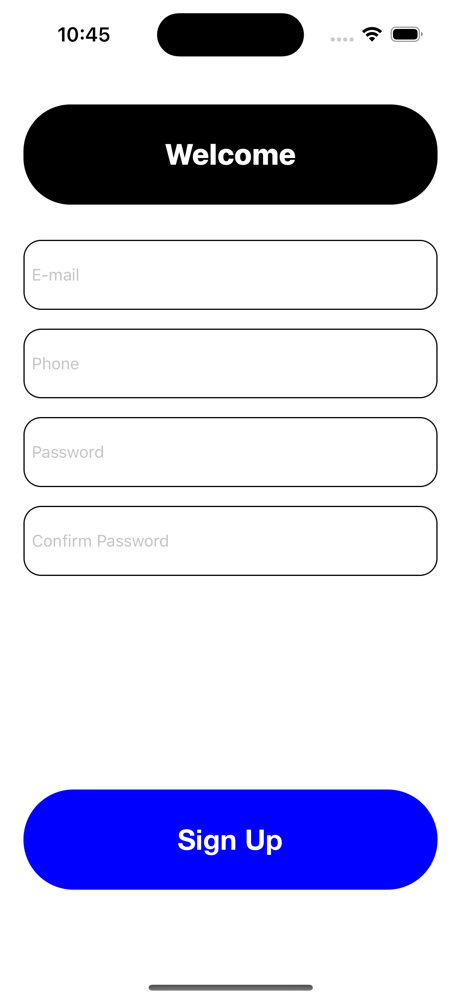

# 📱 CustomUICustom ClassUsingIPOutletAndIPAction

This is a simple UIKit-based iOS app built using **Storyboard**, created to practice essential concepts like **Custom Class**, **Identity Inspector**, and connecting UI to code via **IBOutlet & IBAction**.

---

## 🎯 Goal

Understand how to:
- Create reusable **Custom Classes** for UI elements
- Use **Identity Inspector** to link UI elements with code
- Customize UI elements like `UITextField` from code using `.layer`
- Use `IBOutlet` and `IBAction` effectively
- Apply dynamic corner radius for circular shapes

---

## 🛠️ Tech Stack

- Swift
- UIKit
- Storyboard
- Identity Inspector
- Auto Layout
- Xcode

---

## 📸 Screenshots

 iPhone 15 
  

---

## 🚀 What I Learned

- How to create a **Custom UITextField** subclass with shared styling
- How to use **@IBInspectable** and **@IBDesignable** to tweak UI directly from storyboard
- The role of `.layer` in modifying:
  - `cornerRadius`
  - `borderWidth`
  - `borderColor`
- How to make `cornerRadius = frame.height / 2` to get circular fields
- How to use `IBOutlet` to control UI from code
- How to use `IBAction` to respond to button taps

---

## 💡 Notes

> This project is part of my iOS learning journey.  
> The main goal is to focus on **code reuse**, **UI customization**, and **code–UI connection**.

---

## 🔗 Connect with Me

